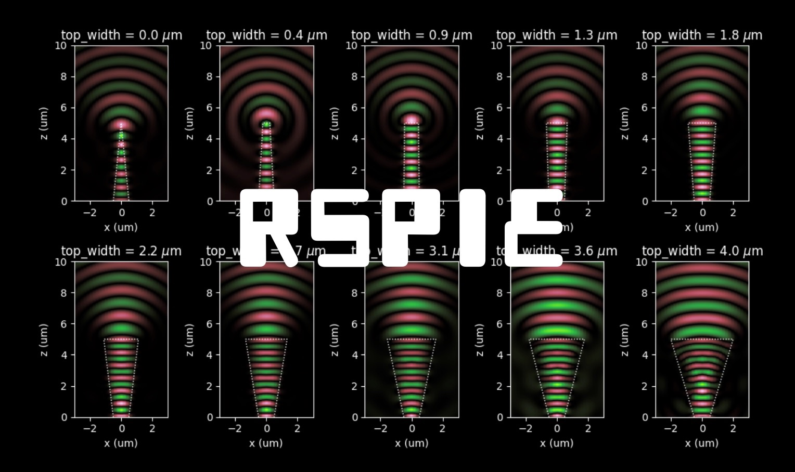

<center>  </center>

`rspie` is an assortment of tools to launch and analyze computational electromagnetism simulations in Photonic Tools.


## File: dipfields.py
### Edipx(x,  xd,  y,  yd,  z,  zd,  thetadip,  phidip,  omega)
### Edipy(x,  xd,  y,  yd,  z,  zd,  thetadip,  phidip,  omega)
### Edipz(x,  xd,  y,  yd,  z,  zd,  thetadip,  phidip,  omega)
### Bdipx(x,  xd,  y,  yd,  z,  zd,  thetadip,  phidip,  omega)
### Bdipy(x,  xd,  y,  yd,  z,  zd,  thetadip,  phidip,  omega)
### Bdipz(x,  xd,  y,  yd,  z,  zd,  thetadip,  phidip,  omega)
## File: emfields.py
### Edipx(x,  xd,  y,  yd,  z,  zd,  thetadip,  phidip,  omega)
```Docstring:
x-component of the electric field at position (x, y, z) of an electric
 dipole with frequency omega and located at position (xd, yd, zd) including
 near-field components.
```
### Edipy(x,  xd,  y,  yd,  z,  zd,  thetadip,  phidip,  omega)
```Docstring:
y-component of the electric field at position (x, y, z) of an electric
 dipole with frequency omega and located at position (xd, yd, zd) including
 near-field components.
```
### Edipz(x,  xd,  y,  yd,  z,  zd,  thetadip,  phidip,  omega)
```Docstring:
z-component of the electric field at position (x, y, z) of an electric
 dipole with frequency omega and located at position (xd, yd, zd) including
 near-field components.
```
### Edipfarx(x,  xd,  y,  yd,  z,  zd,  thetadip,  phidip,  omega)
```Docstring:
x-component of the electric field at position (x, y, z) of an electric
 dipole with frequency omega and located at position (xd, yd, zd) in its
 radiation zone.
```
### Edipfary(x,  xd,  y,  yd,  z,  zd,  thetadip,  phidip,  omega)
```Docstring:
y-component of the electric field at position (x, y, z) of an electric
 dipole with frequency omega and located at position (xd, yd, zd) in its
 radiation zone.
```
### Edipfarz(x,  xd,  y,  yd,  z,  zd,  thetadip,  phidip,  omega)
```Docstring:
z-component of the electric field at position (x, y, z) of an electric
 dipole with frequency omega and located at position (xd, yd, zd) in its
 radiation zone.
```
### Bdipx(x,  xd,  y,  yd,  z,  zd,  thetadip,  phidip,  omega)
```Docstring:
x-component of the magnetic field at position (x, y, z) of an electric
 dipole with frequency omega and located at position (xd, yd, zd) including
 near-field components.
```
### Bdipy(x,  xd,  y,  yd,  z,  zd,  thetadip,  phidip,  omega)
```Docstring:
y-component of the magnetic field at position (x, y, z) of an electric
 dipole with frequency omega and located at position (xd, yd, zd) including
 near-field components.
```
### Bdipz(x,  xd,  y,  yd,  z,  zd,  thetadip,  phidip,  omega)
```Docstring:
z-component of the magnetic field at position (x, y, z) of an electric
 dipole with frequency omega and located at position (xd, yd, zd) including
 near-field components.
```
### Bdipfarx(x,  xd,  y,  yd,  z,  zd,  thetadip,  phidip,  omega)
```Docstring:
x-component of the magnetic field at position (x, y, z) of an electric
 dipole with frequency omega and located at position (xd, yd, zd) in its
 radiation zone.
```
### Bdipfary(x,  xd,  y,  yd,  z,  zd,  thetadip,  phidip,  omega)
```Docstring:
y-component of the magnetic field at position (x, y, z) of an electric
 dipole with frequency omega and located at position (xd, yd, zd) in its
 radiation zone.
```
### Bdipfarz(x,  xd,  y,  yd,  z,  zd,  thetadip,  phidip,  omega)
```Docstring:
z-component of the magnetic field at position (x, y, z) of an electric
 dipole with frequency omega and located at position (xd, yd, zd) in its
 radiation zone.
```
## File: rspie.py
### send_message(message)
### rectangular_meta_atom(config,  simulscript,  hide,  cleanup)
```Docstring:
This  function  runs  a  simulation  using DiffractMOD to estimate the
phase  difference  that  a  rectangular  pillar  of given geometry and
composition will provide to a plane wave at normal incidence.

This is done by simulating a periodic grating in a square lattice with
the pillar in the center.

The launch field, as configured in the auxiliary script, is assumed to
be  a  plane wave at normal incidence, and is launched from inside the
substrate. The launch field has linear polarization along the x-axis.

The  pillar  is  assumed  to be on top of a substrate whose refractive
index can also be provided.

All the refractive indices are assumed to be real and isotropic.

The width is the length of the pillar along the x-axis, and the height
is  the  length  along the y-axis. This before the rotation defined by
Angle is applied.

Parameters
----------
config (dict) : with the following keys (not all which need to be provided)
    'Angle' (float)  : angle (in degrees) that orients the pillar (default=0)
    'Aspect' (float) : width/height of the pillar (default=1)
    'Fill'   (float) : width/Period (used to fix width) (default=0.25)
    'Period' (float) : period of the square lattice in um.
    'PillarHeight' (float): length of pillar (in um) in the z-dir (measured from the top of the substrate)
    'PillarIndex'  (float): refractive index of the pillar
    'SubstrateIndex' (float): refractive index of the substrate
    'background_index' (float): refractive index of the background
simulscript (str): path to the template circuit to run the simulation
hide (bool)      : whether to hide the simulation window or not
cleanup (bool)   : whether to delete the output files or not

Returns
-------
(float, float) : (overlap_magnitude, overlap_phase_in_degrees)
```
### loadfld(filename)
```Docstring:
Parameters
----------
filename (str): path to the .fld file

Returns
-------
extent, data (tuple): (extent, data)
    extent (tuple): (xmin, xmax, zmin, zmax)
    data (np.ndarray): 2D array of the data
```
### selfref_def_parser(def_text,  aux_vars,  max_iteration_depth)
```Docstring:
Give a text string of definitions, parse them into a dictionary.
Each line in the text string should be of the form: var_name = var_value
where var_name should be a valid Python variable name, and var_value
a string or an expression that may depend on the other variables defined
in the given text.

The given text might have commentary lines starting with #, which will
make them be omitted. The text may also have empty lines.

If provided aux_vars is a dictionary whose values and keys will also be used
to make sense of the definitions in the given text.

Parameters
----------
def_text (str): text string of definitions
aux_vars (dict): auxiliary variables to be used in the expressions
max_iteration_depth (int): number of iterations to try to parse the definitions

Returns
-------
vars_dict (dict): dictionary of definitions

Example
-------
>>> def_text = '''x = 1
y = x+1
'''
>>> def_dict = recursive_def_parser(def_text)
>>> print(def_dict)
    {'x': 1, 'y': 2}
```
### load_3d_dat(fname)
```Docstring:
This function can be used to load a 3D .dat file from RSoft.
It assumes that the file has real-valued data.

Parameters
----------
fname (str): path to the .dat file

Returns
-------
x_coords, y_coords, z_coords, num_array (tuple): (x_coords, y_coords, z_coords, num_array)
    x_coords (np.ndarray): 1D array of the x coordinates
    y_coords (np.ndarray): 1D array of the y coordinates
    z_coords (np.ndarray): 1D array of the z coordinates
    num_array (np.ndarray): 3D array of the data
```
### load_2d_dat(fname)
```Docstring:
This function can be used to load a 2D .dat file from RSoft.
It assumes that the file has real-valued data.

Parameters
----------
fname (str): path to the .dat file

Returns
-------
(tuple): (x_coords, y_coords, num_array, file_format)
    file_format (str): the format of the data in the file
    x_coords (np.ndarray): 1D array of the x coordinates
    y_coords (np.ndarray): 1D array of the y coordinates
    num_array (np.ndarray): 2D array of the data with each row corresponding to strip of 
                            constant y and each column corresponding to a strip of constant x.
                            The first row corresponds to the lowest (x,y) value pair.
    
```
### save_2D_array_to_dat(fname,  data_array,  wavelength,  xmin,  xmax,  ymin,  ymax)
```Docstring:
This function saves a 2D array to a dat file that can be read by RSoft.
xmin, xmax, ymin, ymax need to match the bounds of the simulation volume
in the RSoft simulation where the file will be used as input.

Parameters
----------
fname (str)  : The filename where the data will be saved.
data_array (numpy.ndarray) : The 2D array that will be saved.
wavelength (float) : The wavelength of the simulation.
xmin (float) : The minimum x value of the simulation.
xmax (float) : The maximum x value of the simulation.
ymin (float) : The minimum y value of the simulation.
ymax (float) : The maximum y value of the simulation.

Returns
-------
None
```
### dipole_field(x,  y,  z,  xd,  yd,  zd,  thetadip,  phidip,  omega)
```Docstring:
Calculates the electric and magnetic fields of an electric dipole.

Parameters
----------
x, y, z          : (float, float, float) coordinates of the point where the field is calculated
xd, yd, zd       : (float, float, float) coordinates of the dipole
thetadip, phidip : (float, float) polar and azimuthal angles of the dipole moment
omega            : (float) frequency of the dipole

Returns
-------
EBfield : (np.array) electric and magnetic fields (Ex, Ey, Ez, Bx, By, Bz)
```
### dipole_field_far(x,  y,  z,  xd,  yd,  zd,  thetadip,  phidip,  omega)
```Docstring:
Calculates the electric and magnetic fields of an electric dipole in the
radiation zone.

Parameters
----------
x, y, z          : (float, float, float) coordinates of the point where the field is calculated
xd, yd, zd       : (float, float, float) coordinates of the dipole
thetadip, phidip : (float, float) polar and azimuthal angles of the dipole moment
omega            : (float) frequency of the dipole

Returns
-------
EBfield : (np.array) electric and magnetic fields (Ex, Ey, Ez, Bx, By, Bz)
```
### intervalspace(lmin,  lmax,  dx,  symm)
```Docstring:
This  function  returns  a  numpy  array  of evenly spaced points
between  lmin  and  lmax with a spacing of dx. If symm is 'even',
the  array  will  have  an  even  number  of points symmetrically
distributed  about  the midpoint without including it. If symm is
'odd', the array will have an odd number of points with the given
points  symmetrically  distributed  about the midpoint, including
the  midpoint  itself. Given this the given array may not contain
the endpoints lmin and lmax.

    Parameters
    ----------
    lmin (float) : the minimum value of the interval
    lmax (float) : the maximum value of the interval
    dx (float)   : the spacing between points
    symm (str)   : wheter to include the midpoint or not.

    Returns
    -------
    interspace (numpy array): The evenly spaced array of points
    
```
### metamaker(metal_config)
```Docstring:
This function takes a dictionary of parameters defining a metalens
and returns a circuit object that corresponds to it.
The circuit also includes a launch field consisting of a plane wave
incident at normal incidence.
The circuit also includes a DFT monitor that monitors the field at
the end of the pillars and saves Ex, Ey, Ez, Hx, Hy, Hz when the circuit
is run.

Parameters
----------
metal_config : dict
    A dictionary of parameters defining a metasurface. The keys are:
    ApertureRadius : float
        The radius of the aperture in the metasurface.
    period : float
        The period of the square grid of pillars in the metasurface.
    PillarHeight : float
        The height of the pillars in the metasurface.
    circuitFname : str
        The name of the file to save the circuit to.
    PillarIndex : float
        The index of refraction of the pillars.
    SubstrateIndex : float
        The index of refraction of the substrate.
    background_index : float
        The index of refraction of the background.
    free_space_wavelength : float
        The wavelength of the light in free space.
    phase_func : function
        A function that takes in x and y coordinates and returns the
        radius that a post at that location should have. For example
        this could be the classical Fresnel phase profile.
    pillar_func : function
        A function that takes in a phase and returns the width that
        a post at that location should have to impart that phase. This
        would usually be a function that is an interpolation radii and
        phases that a previous simulation should have provided.
Returns
-------
circuit : rspie.circuit.Circuit
```
### fresnel_profile(focal_length,  medium_wavelength)
```Docstring:
This function returns a function that takes x and y coordinates 
and returns the required phase pickup for the given focal length
and medium wavelength.
```
### atom_maker(config)
```Docstring:
This function determines the phase profile of meta-atoms with the given
characteristics.
The meta-atoms have a rectangular cross section.

Parameters
----------
config : dict with keys:
    'focal_length' : float
        focal length of the lens
    'medium_wavelength' : float
        wavelength of the medium
    'Period' : float
        period of the square grid used to simulate the phase response of meta-atoms
    'free_space_wavelength' : float
        wavelength of the free space
    'PillarIndex' : float
        index of the pillar
    'SubstrateIndex' : float
        index of the substrate
    'background_index' : float
        index of the background
    'Angle' : float
        angle of the rectangular meta-atom
    'fill_steps' : int
        number of fill_factors to use
    'Har' : int
        how many harmonics are used in the RCWA simulation
    'Aspect' : float
        aspect ratio of the rectangular meta-atom
    'min_width' : float
        minimum width of the pillars
    'max_width' : float
        maximum width of the pillars

Returns
-------
overlap_phases : np.array
    overlap phases for each fill factor, given in radians
pillar_widths : list of floats
    widths of the pillars corresponding to the phases
```
### waveguide_modes(config,  cleanup,  verbose)
```Docstring:
Parameters
----------
config : dict
    dictionary of parameters for the simulation
simulscript : str
    path to the simulation script
cleanup : bool
    whether to delete the mode files after the simulation is complete
verbose : bool
    whether to print the output of the simulation to the console
Returns
-------
modes : list of dicts
    list of mode dictionaries, each with keys:
        'mode' : np.array
            mode field
        'neff' : float
            effective index of the mode
        'width' : float
            width of the mode
        'height' : float
            height of the mode
```
### load_mode_data(filename)
```Docstring:
This function can be used to read
the data stores in the output fiels from
the Photonic Tools mode solver.

Parameters
----------
filename : str

Returns
-------
extent (tuple), lines(np.array), n_eff (np.array)
```
### __init__(self,  config)
### parse_config(self)
```Docstring:
Put everything together
```
### block_parser(self,  block_dicts,  block_header,  offset)
```Docstring:
Create  a string of definitions using the key-value pairs in
the  given  dictionary,  prepending  and  appending adequate
headers and footers.

Parameters
----------
block_dicts (list): a list with dictionaries defining the block
block_header (str): header of the block (e.g. 'segment')
offset (int)      : offset to add to the index of the block

Returns
-------
(tuple) (block_length (int) , block(str))
```
### make_circuit_text(self)
```Docstring:
Put together the circuit text from the its segments,
monitors, launch fields and variables.

Parameters
----------
None

Returns
-------
circuit_text (str): the circuit text
```
### parse_vars(self)
```Docstring:
Parse self.vars as instance attributes.

Parameters
----------
None

Returns
-------
None
```
### save_to_file(self)
```Docstring:
Save circuit to self.full_filename.

Returns
-------
None
```
### run(self)
```Docstring:
Run the circuit.

Parameters
----------
None

Returns
-------
None
```
### open_in_RSoft(self)
```Docstring:
Opens the created circuit in RSoft.
```
### __str__(self)
### __repr__(self)
### phase_func(x,  y)
